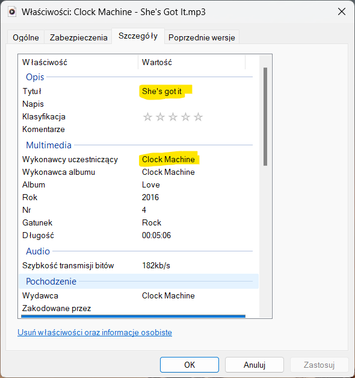

# TrackToolHelper
Narzędzie do wspomagania dodawania intro i outro piosenek w programie RadioBoss.

### Działanie programu
Dodawanie intro i outro do RadioBossa podzielone jest na kilka etapów wylistowanych poniżej. 
Każdy krok będzie wyjaśniony w dalszej części dokumentu.

0. **Uzupełnienie metadanych piosenki: wykonawca i tytuł** - ważne
1. Odseparowanie wokalu od piosenki.
2. Analiza wokalu.
3. Zapisanie wyników (opcjonalne, ale rekomendowane).
4. Aktualizacja bazy danych RadioBossa.

### Szczegółowy opis

#### 0. Uzupełnienie metadanych piosenki
Istotne jest, by wykonawca oraz tytuł utworu były uzupełnione, ponieważ dane te są wykorzystywane w późniejszych krokach.
Na poniższym zdjęciu zaznaczono rozpatrywane w tym punkcie pola.

By usprawnić proces dodawania metadanych można posłużyć się programem OneTagger dostępnym pod tym linkiem: https://onetagger.github.io

#### 1. Odseparowanie wokalu od piosenki
Wokale są oddzielane od piosenki za pomocą aplikacji dostępnej na stronie internetowej https://vocalremover.org/. Następnie są pobierane do domyślnego folderu z pobranymi rzeczami (prawdopodobnie _Pobrane_/_Downloads_).
By nie zaburzyć działania programu w tym kroku, gorąco zaleca się nie korzystać z komputera. W przypadku wystąpienia błędu lub po zakończeniu przetwarzania ostatniej piosenki, przeglądarka może nie zamknąć się automatycznie.

Część programu odpowiedzialna za pobieranie znajduje się w zakładce _get vocs_.

   
Objaśnienia:
1. Ścieżka do folderu z piosenkami w formacie mp3 lub wav (wav nie zostało przetestowane). W podanej lokalizacji zostaną przeszukane również wszystkie podfoldery. 
2. Sprawdza czy w _Pobranych_ znajduje się już plik z takimi samymi metadanymi (wykonawca i tytuł) jak kolejna przetwarzana piosenka, dzięki czemu nie trzeba usuwać/przenosić plików z wokalami po każdym użyciu programu. Uwaga, jeżeli w _Pobranych_ znaduje się plik dowolny plik mp3/wav z takimi samymi metadanymi, program uzna, że wokal jest już _Pobranych_.
3. Sprawdza czy dana piosenka w bazie danych RadioBossa istnieje oraz ma zapisane intro lub outro. Jeśli tak, piosenka nie będzie przetwarzana. Jeżeli ścieżka do bazy nie jest uzupełniona automatycznie, należy ją podać.
4. Sprawdza czy piosenka znajduje się w zapisanym uprzednio pliku json, który zawiera wyniki analizy wokalu (więcej informacji w opisie kroku 3). 
5. Sprawdza czy wokale (czy w zasadzie plik z takimi samymi metadanymi jak kolejna przetwarzana piosenka) znajduje się we wskazanym folderze na wypadek gdyby pliki z wokalami były przeniosione z _Pobranych_ do innej lokalizacji.
6. Wybór przeglądarki. Nie powinien mieć znaczenia.
7. _Start_ - rozpoczęcie procesu odseparowywania wokali od piosenek. _Stop_ - zakończenie tego procesu. Uwaga, po naciśnięciu przycisku _Stop_, program nie przestanie działać natychmiastowo. Najpierw zakończy się przetwarzanie aktualnej piosenki.

#### 2. Analiza wokalu
Jeżeli mamy już pliki z samymi tylko wokalami, możemy je przeanalizować w zakładce _intro2db_. 

Najpierw wokal jest normalizowany, jego najgłośniejsza część otrzymuje wartość 1, cisza natomiast wartość 0. Następnie wybierane są tylko te fragmenty, których poziom natężenia spełnia zadany theshold. Na końcu sprawdzane jest po jakim czasie od początku utworu wchodzi wokal (intro) oraz ile sekund przed końcem piosenki kończy się wokal (outro). Wyniki prezentowane są zakładce _results_. Jeżeli dany utwór jest instrumentalny, bardzo możliwe, że ścieżka jego "wokalu" będzie posiadała jakieś artefakty/śmieci. Dlatego też jeżeli całkowita długość wokalu jest mniejsza niż 3 sekundy, plik nie jest dodawany do wyników, a informacja o tym znajduje się w logach oraz w generowanym pliku _is_it_instrumental.txt_.

Objaśnienia:
1. Ścieżka do bazy danych RadioBossa. Jeżeli pole jest puste, należy wybrać bazę.
2. Folder z pobranymi wokalami. Uwzględniwszy wszystkie opcje (punkty 3, 4 i 5) można rozpocząć analizę wokali za pomocą przycisku _Odczytaj z mp3_. W dowolnym momnecie można zatrzymać działanie programu za pomocą przycisku _Stop_. Uwaga, program nie zakończy działania natychmiastowo. Analiza bieżącego pliku zostanie doprowadzona do końca. Wyniki analizy znajdują się w zakładce _results_.
3. Poziom natężenia dźwięku, od którego rozpatrujemy go jako wokal, może być zmieniany suwakiem. Uwaga, niektóre dźwięki wydawane przez instrumenty mogą być zakwalifikowe jako wokal (najczęściej jest to jakiś saksofon czy sprzężenia gitary). Mimo że nie są to głośne dźwięki (w kontekście ścieżki z wokalem), należy o nich pamiętać przy ustawianiu thresholdu.
4. Omija wokale piosenek, które w bazie RadioBossa mają już intro lub outro. Uwaga, wykonawca i tytuł w pliku w wokalem musi być taki sam jak w bazie danych.
5. Wczytane uprzednio z pliku json dane są widoczne w zakładce _results_, tak samo jak wyniki analizy. Jeżeli jakaś piosenka już się tam znajduje, program nie będzie analizował wokalu dla tej piosenki.

#### 3. Zapisanie wyników (opcjonalne, ale rekomendowane)
W przypadku gdy istnieje wiele plików do przetworzenia, co wymaga dużo czasu, można podzielić analizę na kilka podejść. 
Pliki brane do analizy nie muszą mieć porządku struktury plików, możliwe, że są ułożone alfabetycznie, dlatego żeby nie musieć sprawdzać, który z plików został przetworzony, można zapisać dane do pliku json i przy kolejnym uruchomieniu programu wczytać je.

Kolejnym przykładem gdzie zapisanie danych może być pomocne jest sytuacja, kiedy w bazie danych RadioBossa nie ma jeszcze piosenek, które są poddawane analizie. Przeanalizowane utwory można zapisać w pliku json, następnie zadbać o to, by były dodane do bazy danych RadioBossa (muszą pojawić się w playliście przynajmniej raz) i (jeżeli Helper był w międzyczasie zamykany) ponownie wczytać dane i zapisać dane. 

Wyniki mągą zostać wyczyszczone przyciskiem _Czyść wyniki_. Wyniki mogą być wczytywane z kilku plików json. 

#### 4. Aktualizacja bazy danych RadioBossa
#### Ważne!
- **Piosenki, których intra/outra chcemy dodać do bazy, muszą być przynajmniej raz dodane do playlisty** (nie muszą być odtwarzane).
- **Przed zapisem danych w bazie należy zamknąć RadioBossa** (jeżeli jest otwarty, dane zostaną zauktualizowane po ponownym uruchomieniu programu).

Zapisanie intra/outra piosenki następuje wskutek wciśnięcia klawisza _Zapisz w bazie_. Piosenki mogą zostać nadpisane (np. kiedy mamy nowe wyniki ze zmienionym thresholdem).

### TODO:
- Przenoszenie wyników analizy pomiędzy komputerami.
